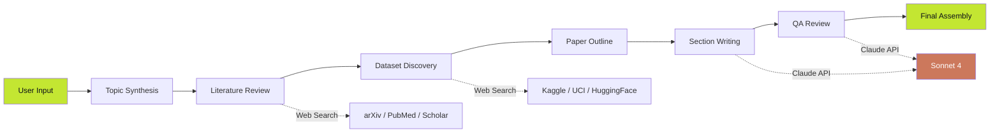

<div align="center">

<!-- BANNER -->


<!-- BADGES -->
[](LICENSE)
[](https://reactjs.org/)
[](https://anthropic.com)
[](#-deployment)
[](CONTRIBUTING.md)
[](https://github.com/kushagra486/thesis-ai)

<br/>

<p align="center">
  <strong>Turn a single research idea into a publication-ready academic paper — powered by AI.</strong>
</p>

<p align="center">
  <a href="#-features">Features</a> •
  <a href="#-demo">Demo</a> •
  <a href="#-quick-start">Quick Start</a> •
  <a href="#-architecture">Architecture</a> •
  <a href="#-deployment">Deployment</a> •
  <a href="#-tech-stack">Tech Stack</a> •
  <a href="#-contributing">Contributing</a>
</p>

<br/>

<!-- DEMO GIF PLACEHOLDER -->


<br/><br/>

</div>

---

## 🧠 What is Thesis?

**Thesis** is an AI-powered research paper generator that transforms a simple research idea into a **complete, publication-grade academic paper** — with real literature reviews, dataset discovery, section-by-section writing, and an automated peer review quality assessment.

> 💡 **Just describe your idea.** Thesis handles the rest — from searching arXiv and PubMed for related work, to discovering datasets on Kaggle and HuggingFace, to writing every section with academic rigor.

---

## ✨ Features

<table>
<tr>
<td width="50%">

### 🔬 Intelligent Research Pipeline
- **6-stage AI workflow** from idea to finished paper
- Real-time progress tracking with live status updates
- Automatic topic synthesis and gap identification

### 🌐 Web-Powered Literature Review
- Searches **arXiv, PubMed, Google Scholar** in real-time
- Identifies 6-8+ real papers with citations
- Maps research gaps and positions your contribution

### 📊 Automated Dataset Discovery
- Scans **Kaggle, UCI, HuggingFace, Papers With Code**
- Returns dataset descriptions, sizes, licenses, and URLs
- Suggests benchmark datasets and evaluation metrics

</td>
<td width="50%">

### ✍️ Section-by-Section Academic Writing
- Writes **8 full sections** (Abstract → Conclusion)
- Formal academic English with proper citations `[Author, Year]`
- Mathematical formulations in Methodology
- Realistic experimental results with specific numbers

### 🔍 AI Peer Review Simulation
- **7-dimensional quality scoring** (Novelty, Methodology, Clarity, Completeness, Cohesion, Rigor, Originality)
- Accept / Minor Revision / Major Revision / Reject verdict
- Detailed strengths, weaknesses, and improvement suggestions

### 📤 Export & Download
- Download as Markdown (`.md`)
- Full research bundle (literature + datasets + paper)
- Ready for LaTeX conversion or journal submission

</td>
</tr>
</table>

---

## 🎨 Dashboard Layout

```
┌──────────────────────────────────────────────────────────────────┐
│  🔬 THESIS                                          🔔  👤 User │
├────────┬─────────────────────────────────────────────────────────┤
│        │  Research Project                                       │
│ ◫ Dash │  The Impact of Distributed Ledger Technology...  [Export]│
│ ◉ Proj ├──────────────┬──────────────────┬───────────────────────┤
│ ⊞ Data │  PROJECT     │  AI WORKFLOW     │  DATA & RESOURCES    │
│ ❝ Cite │  OVERVIEW    │  TRACKER         │  FOUND               │
│ ◎ Draft│              │  ✓─✓─●─○─○─○    │  📊 Kaggle           │
│ ✓ QA   │  [textarea]  │  65% progress    │  🧬 PubMed           │
│ ⚙ Set  │  [tags]      │  status lines... │  🏛️ OECD             │
│        │  [Generate]  │                  │  25 papers found     │
│        ├──────────────┴──────────┬───────┴───────────────────────┤
│        │  PAPER PREVIEW          │  CITED REFERENCES    12      │
│        │                         │  1. Author, 2024...          │
│        │  ┌─── white card ────┐  │  2. Author, 2023...          │
│        │  │ THE EFFECTIVENESS │  ├──────────────────────────────│
│        │  │ OF ZERO-KNOWLEDGE │  │  AI QUALITY SCORE            │
│        │  │ PROOFS IN...      │  │  88% Publishable             │
│        │  │                   │  │  Cohesion     ████████░ 88%  │
│        │  │ ABSTRACT          │  │  Methodology  ██████░░░ 65%  │
│        │  │ ...               │  │  Originality  ████████░ 88%  │
│        │  └───────────────────┘  │                              │
└────────┴─────────────────────────┴──────────────────────────────┘
```

---

## 🚀 Quick Start

### Prerequisites

- A modern web browser (Chrome, Firefox, Safari, Edge)
- That's it! No Node.js, no build tools, no dependencies to install.

### Run Locally

```bash
# Clone the repository
git clone https://github.com/kushagra486/thesis-ai.git

# Navigate to the project
cd thesis-ai

# Open in browser (pick one)
open index.html          # macOS
xdg-open index.html      # Linux
start index.html         # Windows

# Or serve with any static server
python3 -m http.server 8080
npx serve .
```

Then visit `http://localhost:8080` in your browser.

---

## 🏗️ Architecture



### Pipeline Stages

| Stage | Description | AI Tools Used |
|-------|------------|---------------|
| **01 — Topic Synthesis** | Parses and structures the research idea | Claude Sonnet 4 |
| **02 — Literature Review** | Searches web for real papers and citations | Claude + Web Search |
| **03 — Data Harvesting** | Discovers public datasets across platforms | Claude + Web Search |
| **04 — Data Analysis** | Creates detailed paper outline | Claude Sonnet 4 |
| **05 — Drafting** | Writes 8 sections with academic rigor | Claude Sonnet 4 |
| **06 — QA Review** | Simulated peer review with scoring | Claude Sonnet 4 |

---

## 🛠️ Tech Stack

<div align="center">

| Layer | Technology |
|-------|-----------|
| **Frontend** |  via CDN |
| **AI Engine** |  |
| **Search** |  |
| **Fonts** |  |
| **Hosting** |  |
| **Build** |  — Single HTML file |

</div>

---

## 🌐 Deployment

### GitHub Pages (Recommended)

This project auto-deploys via GitHub Actions on every push to `main`.

**Manual setup:**

1. Fork this repository
2. Go to **Settings → Pages**
3. Set Source to **GitHub Actions**
4. Push to `main` — your site deploys automatically

Your site will be live at:
```
https://<username>.github.io/thesis-ai/
```

### Alternative Platforms

<details>
<summary><strong>Netlify</strong></summary>

1. Go to [app.netlify.com/drop](https://app.netlify.com/drop)
2. Drag the project folder → instant deployment

</details>

<details>
<summary><strong>Vercel</strong></summary>

```bash
npx vercel --prod
```

</details>

<details>
<summary><strong>Cloudflare Pages</strong></summary>

1. Connect your GitHub repo at [pages.cloudflare.com](https://pages.cloudflare.com)
2. Set build command to **(empty)** and output directory to `.`

</details>

---

## 📁 Project Structure

```
thesis-ai/
├── index.html                 # Complete app (single file, zero dependencies)
├── README.md                  # This file
├── LICENSE                    # MIT License
├── CONTRIBUTING.md            # Contribution guidelines
├── .github/
│   └── workflows/
│       └── deploy.yml         # GitHub Pages auto-deployment
└── assets/                    # Screenshots & media (optional)
```

---

## 🎯 Supported Research Fields

`Computer Science` · `Data Science & ML` · `Artificial Intelligence` · `NLP` · `Computer Vision` · `Bioinformatics` · `Physics` · `Mathematics` · `Economics` · `Social Sciences` · `Environmental Science` · `Healthcare`

## 📚 Supported Journal Formats

`IEEE` · `Nature` · `ACM` · `Springer` · `Elsevier` · `ArXiv` · `PLoS ONE` · `AAAI` · `NeurIPS`

---

## 🤝 Contributing

Contributions are welcome! Please read our [Contributing Guidelines](CONTRIBUTING.md) first.

```bash
# Fork → Clone → Branch → Commit → Push → PR
git checkout -b feature/amazing-feature
git commit -m "feat: add amazing feature"
git push origin feature/amazing-feature
```

---

## 📜 License

This project is licensed under the **MIT License** — see the [LICENSE](LICENSE) file for details.

---

## 🙏 Acknowledgments

- [Anthropic](https://anthropic.com) — Claude AI powering the research pipeline
- [React](https://reactjs.org) — UI framework
- Built with ❤️ by [Kushagra](https://github.com/kushagra486)

---

<div align="center">


**⭐ Star this repo if you find it useful!**

<a href="https://github.com/kushagra486/thesis-ai/stargazers">
  
</a>
<a href="https://github.com/kushagra486/thesis-ai/network/members">
  
</a>

</div>
